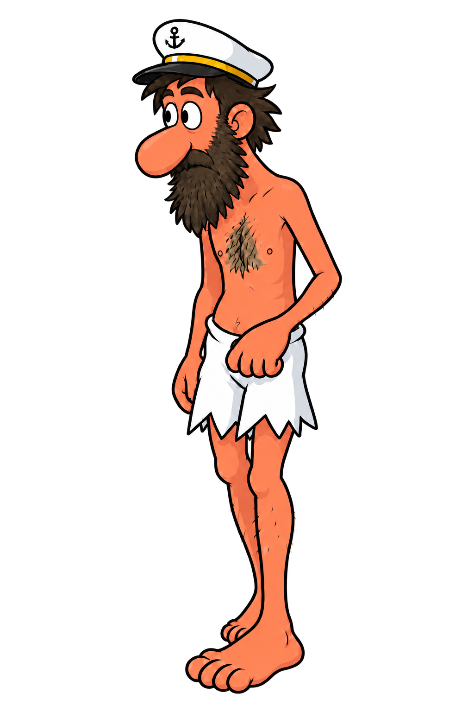
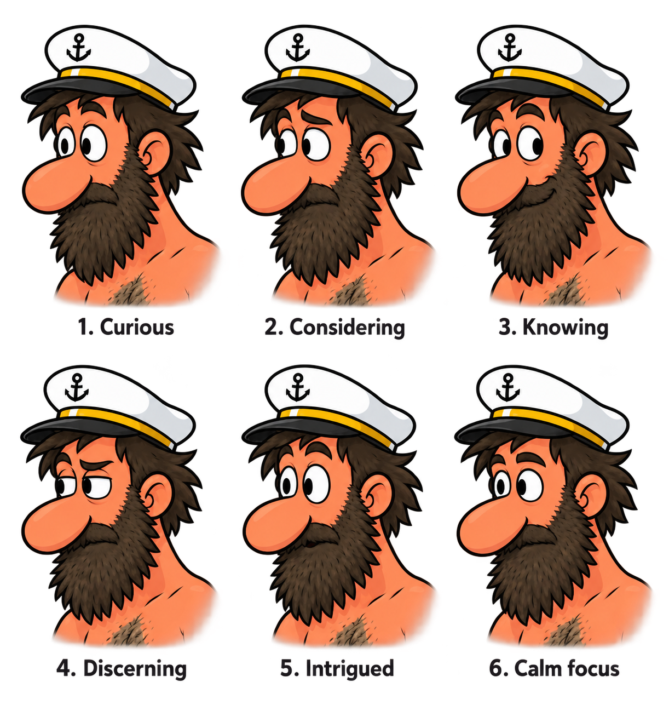

# Original-pose review and expression direction

The user accepted the visible standalone six-source walking motion and Calm
focus expression on 2026-09-15: "looks good, whats next ?".
[standalone-motion-acceptance.json](standalone-motion-acceptance.json) ties that
decision to the exact six PNG hashes, reviewed HTML, route and validation
reports. The original-leg mismatch was reviewed and retained. Runtime exports
and in-scene acceptance remain pending; the 21 production assets are unchanged.

The earlier expression choices were **6. Calm focus**, followed by "Keep the
earlier Calm focus version" for the full-body
[Calm focus key](024-calm-focus-key.png), after an eyebrow-lift variation was
rejected.

## Reproduce the accepted standalone preview

From the repository root, run:

```text
python art/cartoon/walk-pilot/original-pose-corrections-v1/review-evidence/build_standalone_preview.py --output build/standalone-walk.html
```

The portable builder embeds the unchanged repository PNGs into the preserved
template/data and reproduces the exact reviewed HTML SHA-256
`c9472f6daa012287e6004b2fd5492819a88f7ad83177b555b9927f610f9d0948`.
The historical page still says "Draft" and "not installed"; this acceptance
record supplies its current status. The 10.6 MB HTML is not duplicated here.

The copied browser reports contain [8 smoke checks](review-evidence/standalone-walk-smoke-validation.json)
followed by [93 regression checks](review-evidence/standalone-walk-regression-validation.json).
They cover actual PNG loads, controls, all 23 route positions and canvas
transforms. Controlled RAF/performance timestamps test handler timing, not
physical wall-clock cadence. The [rebuild verification](review-evidence/standalone-rebuild-verification.json)
records exact reproduction, refusal controls and two executed guard mutations.

## Pose and expression batch checkpoint

[next-generation-review.json](next-generation-review.json) records nine later
calls, their exact source identities, reference roles, measurements and review
status. Prompt strings, ordered reference paths and returned `output_hint`
strings are preserved unchanged in [next-generation-prompts.json](next-generation-prompts.json),
[simple-shorts-prompt.json](simple-shorts-prompt.json) and
[natural-step-prompt.json](natural-step-prompt.json).

| Frame / attempt | Current status |
|---|---|
| [024 Calm pose v2](024-calm-pose-v2.png) | Accepted in standalone motion. Earlier measured trailing-toe contour changes remain recorded. |
| [025](025-calm-eyes-v1.png), [026](026-calm-eyes-v1.png), [027](027-calm-eyes-v1.png) Calm eyes v1 | Accepted in standalone motion. Eye edits do not establish unchanged body pixels. |
| [028 Calm pose v2](028-calm-pose-v2.png) | Rejected after assistant anatomy review; retained as an actual ancestor of v3. |
| [029 Calm pose v2](029-calm-pose-v2.png) | Accepted in standalone motion. Earlier original-leg linkage and canvas-clearance findings remain recorded. |
| [028 near-left-thigh v3](028-near-left-thigh-v3.png) | User rejected: "no, the shorts look weird". Retained as an actual ancestor of v4. |
| [028 simple shorts v4](028-simple-shorts-v4.png) | User rejected: "try again, it also looks like the foot is optically wrong". Retained as the rejected branch endpoint. |
| [028 natural left step v5](028-natural-left-step-v5.png) | Accepted in standalone motion with the user-confirmed original-leg mismatch retained. |

V5 starts again from the previously accepted 028 raw, the Calm focus key and
the supplied-original native pose. The rejected v2/v3/v4 branch is not its
ancestry. These six sources have standalone motion approval. That decision
does not establish original anatomical parity or runtime/in-scene acceptance.

The user subsequently said: "its still the wrong leg, but since its completely
opposite i think it works, give me a standalone walking animation and let me
look at it please". The resulting animation used 024 v2, 025/026/027 Calm eyes
v1, 028 v5 and 029 Calm pose v2. It retains the existing scale/affines on a
padded canvas so overhanging feet remain visible. The later "looks good"
response accepts that visible motion and Calm expression. It is not a runtime
export or a claim of corrected original anatomy.

All nine returned images are 1024 by 1536. Analytical checks use each frame's
existing scale 0.1 affine without fitting or moving the art. V3 and v4 overhang
both sides; v5 still reaches 2.3 HD pixels beyond the left boundary, including
1,061 source pixel centers at alpha at least 8. Frame 026 has no out-of-canvas
alpha-8 pixel centers, but the top cell edge reaches -0.05 HD pixels. These
measurements distinguish pixel centers from cell bounds and do not replace an
actual filtered export or runtime check. No new runtime sprites were exported.

The early leg corrections retained the wrong connections. Changing hip/thigh
attachments requires reviewing the shorts openings, but forcing a crossing seam
produced wrapped flaps the user rejected. The accepted standalone motion
retains the reviewed original-leg difference; original toe-order parity is not
claimed. Explicit pupil
centering produced a visible forward gaze in these outputs; every output also
redrew pixels beyond the intended edit, so no unchanged-body claim is made.

[acceptance.json](acceptance.json) records the selection separately from the
historical awaiting-selection status in [expression-prompt.json](expression-prompt.json).

## Current expression key



The selected 1024 by 1536 PNG is the exact returned image. Its direct references
were the previously accepted `024-generated-v7.png` and the expression sheet.
The earlier combined expression-and-foot attempt was not selected and was not
used to make this key. The later [inquisitive comparison](024-inquisitive-key.png)
used the Calm key and sheet, but the user rejected its new eyebrow lift. That
comparison is retained for review, not as a selected-key ancestor.

[key-frame-prompts.json](key-frame-prompts.json) and
[inquisitive-prompt.json](inquisitive-prompt.json) preserve exact prompt strings
and actual ordered references, including their historical review statuses.
The current decision is recorded separately in `acceptance.json`.

Technical QA of this Calm key against the accepted 024 raw found the alpha-128
cap top and center unchanged at y41 and x388, silhouette IoU about 99.4974%,
and both silhouettes contained within a 2-raw-pixel square dilation of the
other at alpha at least 8. Its alpha range is 0 through 254. However, 178,168
visible pixels changed in the diagnostic band below raw y520, which is not an
anatomical mask. The requested eye-only edit therefore does not establish
byte-identical body or feet. These measurements apply to this key only and do
not establish runtime registration or original gait geometry.



The sheet's reading order is Curious, Considering, Knowing, Discerning,
Intrigued, and Calm focus. The preserved 1222 by 1287 PNG is the exact returned
image, including its background/alpha and labels. It has not been cropped,
resized, cleaned or extracted into sprites.

## Source and generation

The built-in image generator received the exact prompt in
`expression-prompt.json` and one explicit image reference: the accepted
1024 by 1536 `024-generated-v7.png` from the existing
[directional-cycle source bundle](../directional-cycle-v1/README.md).
Its SHA-256 is
`63088f5c18e71d49fb61f733e564d5f9461c55f622e124b5eeaf9aa5cbd1ee2b`.

[provenance.json](provenance.json) records the actual tool parameters, reference
order, returned file identity and both exact prompt-string and prompt-file
hashes. The original raw reference already exists in its source bundle, so it
is not duplicated here. No rejected pose correction was used as an expression
reference.

## Rejected first pose attempts

Before the expression selection, the assistant rejected three generated pose
attempts after visual review:

| Frame | Attempt | Reason |
|---|---|---|
| 024 | correction v1 | Better inward foot angle, but the trailing foot was raised. |
| 028 | correction v1 | No clear correction of the anatomical leg-order reversal. |
| 029 | correction v1 | Overlap changed, but the head shifted upward and the cap clipped. |

Their exact prompts and reference order remain in [prompts.json](prompts.json).
The provenance records their output hashes, dimensions and rejection reasons.
Unused failed PNGs remain local; they are neither promoted nor claimed as
ancestors of the selected expression concept.

## Original geometry references

The pose attempts used full native canvases from the supplied-original RESOURCE
dump, enlarged by exactly 16 with nearest-neighbor sampling. BMP palette index
0 became transparent RGBA zero; other dump-palette colors remained unchanged.
The preparation verified independently repeated native bytes and copied the
accepted Cartoon raw references byte-for-byte.

The provenance retains the original resource, decoder, dump, native PNG and
16x-reference hashes, canvas dimensions, preparation method and Python/Pillow
versions. Original PNGs and binaries are not duplicated. Original-executable
palette, compositing and rendering parity are not established by these decoded
references. The new expression is an artistic direction, not evidence of the
original character's facial expression.
